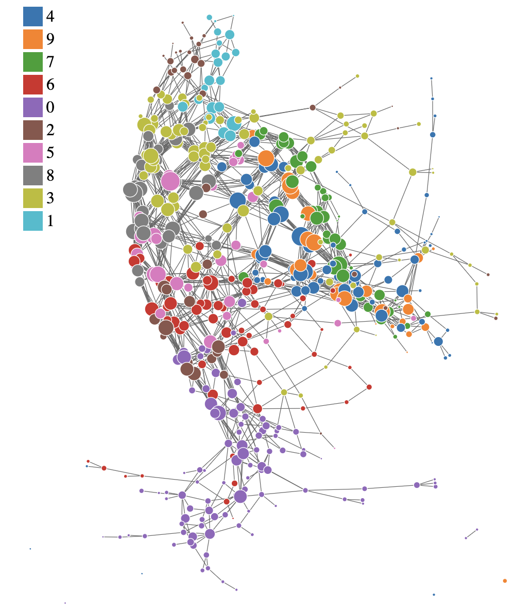

# Mapper

The core of applying the projection space, cover, interval, and clustering is the Mapper algorithm. The Mapper algorithm takes in the original data, filter values, cover parameters, and clustering method to produce a simplicial complex that represents the structure of the original. The output includes an adjacency matrix representing the connections between nodes, the number of vertices (nodes), the level of each vertex, and the points contained in each vertex and level set.
```{r}
knitr::include_graphics("./man/figures/mapper.png")
```

This is the example of the Mapper graph generated from the MNIST dataset. Each node represents a cluster of data points, and edges represent connections between clusters based on shared data points. The structure of the graph can reveal insights about the underlying data distribution and relationships between features.

```{r}

```


## Example Code

```
library(ggplot2)
library(igraph)
library(networkD3)
library(parallel)
library(foreach)
library(doParallel)
library(htmlwidgets)
library(webshot)
library(tidygraph)
library(ggraph)

source('../../MapperAlgo/R/EdgeVertices.R')
source('../../MapperAlgo/R/ConvertLevelsets.R')
source('../../MapperAlgo/R/Cover.R')
source('../../MapperAlgo/R/Cluster.R')
source('../../MapperAlgo/R/SimplicialComplex.R')
source('../../MapperAlgo/R/MapperAlgo.R')

data("iris")
data <- iris
```

## Run Mapper Algorithm
There are several clustering methods available, including DBSCAN, hierarchical clustering, k-means, and PAM. But you need to input all of the params required for the chosen method in method_params.

```
time_taken <- system.time({
  Mapper <- MapperAlgo(
    original_data = data[,1:4],
    filter_values = data[,1:2],
    # filter_values = circle_data[,2:3],
    percent_overlap = 30,
    methods = "dbscan",
    method_params = list(eps = 1, minPts = 1),
    # methods = "hierarchical",
    # method_params = list(num_bins_when_clustering = 10, method = 'ward.D2'),
    # methods = "kmeans",
    # method_params = list(max_kmeans_clusters = 2),
    # methods = "pam",
    # method_params = list(num_clusters = 2),
    cover_type = 'stride',
    # intervals = 4,
    interval_width = 1,
    num_cores = 12
    )
})
time_taken
```

### MapperAlgo Params

MapperAlgo funtion remains several params, **filter_values** is the data you get after pojection, for example, the output of PCA. **Intervals** is how many areas you want, in the example below, you cut the data into 4 areas, and the 4 areas will be **ovelapped** in 30%, then it will calculate the width for you. You can also choose **interval_width** as input, but you can’t use it and Intervals at the same time because it will cause nonuniform intervals in space, vice versa.

You can choose hierarchical, kmeans, dbscan, or pam in **methods**, and according to their original package, you must input a list of params to **method_params**. Then, according to the original author and the paper, stride or extension in **cover_type** can be choose in the function, more informations are explained in File explaination. The num_cores can be set depend on how many cores you want to use for parrallel computing.

MapperPlotter is just plotting the nodes and edges, use forceNetwork if you want to interact with the plot, and ggraph could get you more informations in label. **avg** will give you the mean feature of each node if you set it as TRUE, in the example below, circle_data\$circle is the feature.

### Output data

| Name | Context |
|------------------------------------|------------------------------------|
| **adjacency** | 24x24 adjacency matrix, 0 or 1 |
| **num_vertices** | Mapper nodes num |
| **level_of_vertex** | Each node represent to which level set index, correspond to intervals. |
| **points_in_vertex** | Each node carries original data index |
| **points_in_level_set** | Each level set(16) include data point index, level set represent data subset in a lens function |
| **vertices_in_level_set** | Which node represent to a level set |

## Plots
There are built-in plotting functions to visualize the Mapper graph. You can choose between "ggraph" and "forceNetwork" types. Additionally, you can choose to average feature values over nodes or use conditional probability embeddings.

```
source('../../MapperAlgo/R/Plotter.R')

g <- graph_from_adjacency_matrix(Mapper$adjacency, mode = "undirected")
e_result <- eigen_centrality(g)
MapperPlotter(Mapper, label=e_result$vector, original_data=data, avg=FALSE, use_embedding=TRUE)
```

## Correlation between Mapper graph and features
Sometimes it is useful to find out whether the Mapper graph structure correlates with certain features in the data. For example, if Sepal.Length densities are similar to Sepal.Width densities across the nodes in the Mapper graph.

```
source('../../MapperAlgo/R/MapperCorrelation.R')
MapperCorrelation(Mapper, original_data = original_data, labels = list(data$Sepal.Length, data$Sepal.Width))
```


## Grid Search for optimal cover parameters
If you want to find optimal cover parameters for your data, you can use the GridSearch function. Observing the convergence of certain graph metrics as cover parameters change can help you select appropriate values.

```
source('../../MapperAlgo/R/GridSearch.R')
cpe_params <- list("PW_group", "Species", "wide", "versicolor")
data$PW_group <- ifelse(data$Sepal.Width > 1.5, "wide", "narrow")
labels <- data%>%select(PW_group, Species)
GridSearch(
  filter_values = data[,1:4],
  label = labels,
  column = "Species",
  cover_type = "stride",
  width_vec = c(1),
  overlap_vec = c(30),
  num_cores = 12,
  out_dir = "../mapper_grid_outputs",
  avg = TRUE,
  use_embedding = cpe_params
)
```
