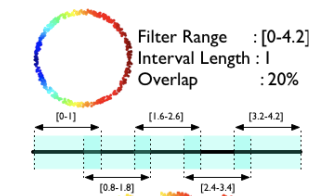
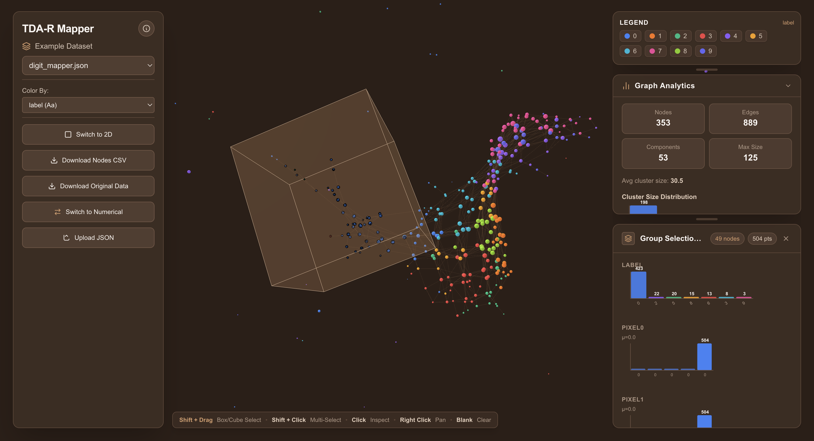
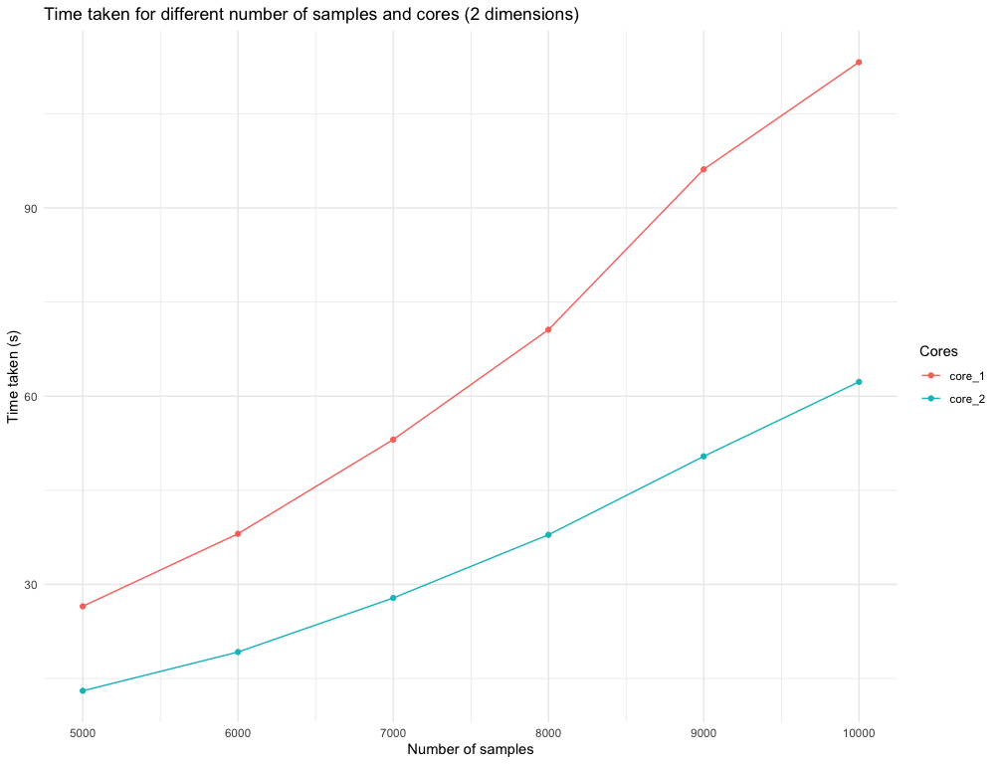
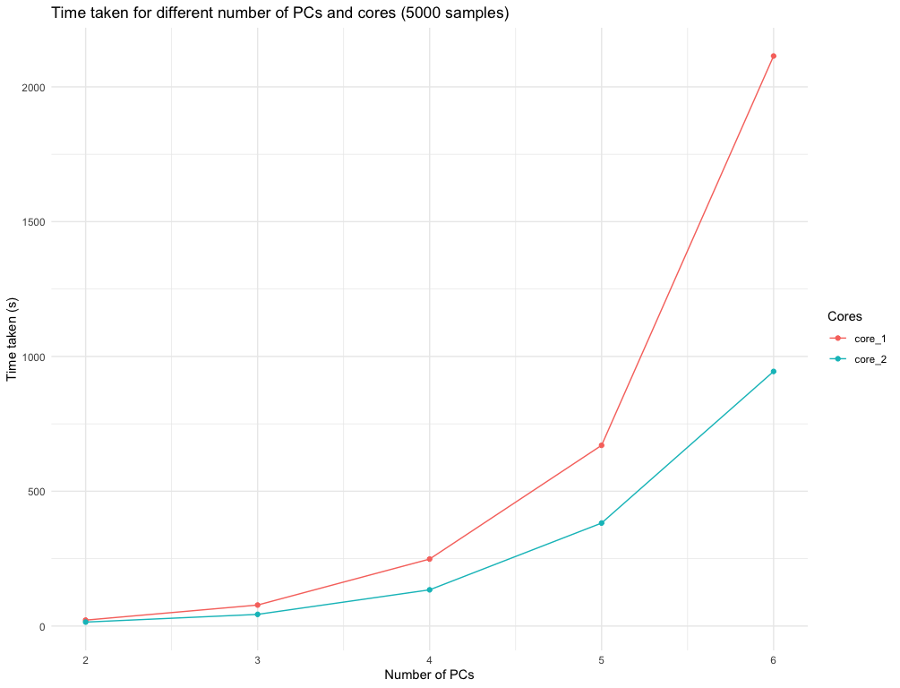

# MapperAlgo

The Mapper construction turns a point cloud into an interpretable graph. A filter (or lens) maps observations to a low-dimensional space, an overlapping cover divides that space into level sets, and observations are clustered independently inside every level set. Each cluster becomes a vertex; two vertices are joined when they contain at least one common observation.

```{r mapper-workflow, echo=FALSE, out.width="72%", fig.align="center"}
knitr::include_graphics("./man/figures/mapper.png")
```

## Installation and a minimal example

Use the installed package by `install.packages('MapperAlgo')`.

```{r mapper-example, eval=FALSE}
library(MapperAlgo)

X <- scale(iris[, 1:4])
lens <- prcomp(X)$x[, 1:2]

mapper <- MapperAlgo(
  original_data = X,
  filter_values = lens,
  intervals = 6,
  percent_overlap = 30,
  methods = "kmeans",
  method_params = list(max_kmeans_clusters = 3),
  cover_type = "stride",
  num_cores = 1
)

# This is the new version of clustering method, which uses mlr3cluster package.
# It is more flexible but a longer calculation time since it need to package up from mlr3.

# mapper <- MapperAlgo(
#   data[,1:4],
#   filter_values = data[,1:3],
#   percent_overlap = 30,
#   method = lrn("clust.kmeans", centers = 2),
#   cover_type = 'stride',
#   interval_width = 1,
#   num_cores = 12
# )
```

`original_data` is used for within-level-set clustering, whereas `filter_values` defines the cover. Supply exactly one of `intervals` and `interval_width`: the package computes the other quantity. For a multidimensional lens, a product cover is formed across its columns. Use `method` if you want to try out the new features that integrated `mlr3` pacakge to the clustering for each interval.

## Covers and level-set indexing

`cover_type = "stride"` uses intervals of width (w) whose starting positions differ by (w(1-p/100)). `cover_type = "extension"` places width-(w) anchors without overlap, then extends each boundary by (wp/200). In both cases, `percent_overlap` is entered as a percentage such as `30`, not as `0.30`.

```{r mapper-cover, echo=FALSE, out.width="76%", fig.align="center"}

```

`cover_points()` returns the row indices inside one rectangular level set. Internally, `to_lsmi()` converts a flat level-set index into its coordinate-wise multi-index, and `to_lsfi()` performs the inverse conversion. These helpers allow a product cover to be traversed with one loop while preserving its multidimensional location.

## Clustering within level sets

The `methods` argument selects one of four implemented methods. The corresponding controls belong in `method_params`.

| `methods` value | Principal controls | Behaviour |
|-----------------------------------|-----------------------------------------------------|--------------------------------------------------------------------------------------------------------------|
| `"hierarchical"` | `method`, `num_bins_when_clustering` | Cuts a hierarchical tree at the first empty distance-histogram bin. |
| `"kmeans"` | `max_kmeans_clusters` | Searches up to the requested number of centres; the default maximum is two. |
| `"dbscan"` | `eps`, `minPts` | Excludes observations labelled as noise when positive clusters exist. |
| `"pam"` | `num_clusters` | Uses partitioning around medoids and caps the requested count below the local sample size. |

Independent level sets are processed by a PSOCK worker pool controlled by `num_cores`. Cover construction, worker start-up, and graph assembly remain outside that parallel loop.

## The returned Mapper object

`MapperAlgo()` returns an object of class `Mapper`. `FuzzyMapperAlgo()` and `GMapperAlgo()` use the same core representation and add their own class and input parameters.

| Field | Meaning |
|----------------------------------------------------|----------------------------------------------------------------------------------------------------|
| `adjacency` | Symmetric, zero-diagonal vertex adjacency matrix. |
| `num_vertices` | Number of clusters, hence Mapper vertices. |
| `level_of_vertex` | Level-set index from which each vertex was produced. |
| `points_in_vertex` | Original observation indices assigned to each vertex. |
| `points_in_level_set` | Observation indices pulled back into each cover element. |
| `vertices_in_level_set` | Vertex indices produced by each cover element. |
| `input_params` | Controls retained for inspection and reproducibility. |

Edges are created when the two lists in `points_in_vertex` intersect. The adjacency matrix therefore records the nerve of the clustered pullback cover, while the index lists preserve the correspondence to the input data.

## Interactive plotting and PNG export

`MapperPlotter()` returns a `networkD3` widget. Vertex size represents the number of observations, edge weight represents shared observations, and colour can show a majority label, an average numeric label, or a precomputed embedding statistic, then save it with `save_mapper_png()`. You can also try `MapperPlotter3D` if you're interest in 3D plot.

```{r mapper-save, eval=FALSE}

widget <- MapperPlotter(mapper, label=iris$Species, avg=FALSE, use_embedding=FALSE)
# widget <- MapperPlotter3D(mapper, label=iris$Species, avg=FALSE, use_embedding=FALSE)

save_mapper_png(
  widget,
  png_path = "./man/figures/IrisMapper.png",
  vwidth = 1400,
  vheight = 1000,
  zoom = 2,
  delay = 0.7
)
```

## F-Mapper: a fuzzy learned cover

`FuzzyMapperAlgo()` replaces the rectangular cover by fuzzy c-means membership functions in the filter space. `cluster_n` specifies the number of fuzzy cover elements. An observation belongs to cover element (j) when its membership exceeds `fcm_threshold`; if no threshold is supplied, the package uses `min(0.1, 1 / cluster_n)`. The pullback sets may overlap, after which the same clustering and nerve construction used by conventional Mapper is applied.

```{r fuzzy-mapper, eval=FALSE}
f_mapper <- FuzzyMapperAlgo(
  original_data = X,
  filter_values = lens,
  cluster_n = 6,
  fcm_threshold = 0.10,
  methods = "kmeans",
  method_params = list(max_kmeans_clusters = 3),
  num_cores = 1
)
```

This variant learns cover membership from the observed lens distribution, but fuzzy-cover fitting occurs before the parallel level-set clustering.

## G-Mapper: a Gaussianity-driven cover

`GMapperAlgo()` accepts a one-dimensional filter. Starting with its complete range, `recursive_gaussian_split()` applies an Anderson--Darling normality test. A non-Gaussian interval is split with a Gaussian mixture model, and the children are enlarged according to `g_overlap`; recursion stops when the interval passes the criterion or a safety condition is reached. `AD_threshold` controls the splitting criterion.

```{r gaussian-mapper, eval=FALSE}
g_mapper <- GMapperAlgo(
  original_data = X,
  filter_values = lens[, 1],
  AD_threshold = 0.5,
  g_overlap = 0.5,
  methods = "kmeans",
  method_params = list(max_kmeans_clusters = 2),
  num_cores = 1
)
```

## Frontend

If you want to try out the frontend to analyse your data, you can try out our [Frontend](https://tda-rfrontend.vercel.app/) for a better understand with toy data results and your own data.

```{r frontend-save, eval=FALSE}
library(jsonlite)

export_data <- list(
  adjacency = GMapper$adjacency,
  num_vertices = GMapper$num_vertices,
  level_of_vertex = GMapper$level_of_vertex,
  points_in_vertex = GMapper$points_in_vertex,
  original_data = data
)

write(toJSON(export_data, auto_unbox = TRUE), "~/desktop/data.json")
```

{width="914"}

## Node summaries, conditional probabilities, and grid search

`MapperCorrelation()` aggregates an observation-level quantity over every Mapper vertex. `CPEmbedding()` computes node-wise conditional probabilities of the form (P(B=b\mid A=a)), which can be passed to `MapperPlotter(..., use_embedding = TRUE)`.

`GridSearch()` evaluates width--overlap combinations, renders every resulting graph, and saves the PNG files to `out_dir`. The current implementation uses DBSCAN with `eps = 0.3` and `minPts = 1` inside the grid search.

```{r mapper-grid-search, eval=FALSE}
GridSearch(
  original_data = X,
  filter_values = lens,
  label = iris$Species,
  cover_type = "stride",
  width_vec = c(0.5, 1.0, 1.5),
  overlap_vec = c(10, 20, 30),
  num_cores = 2,
  out_dir = "./man/figures/mapper_grid"
)
```

## Performance controls

The principal computational controls are `num_cores`, cover resolution, and clustering parameters. More cover elements produce more independent clustering tasks; greater overlap can repeat observations across more level sets. The package precomputes the point memberships of each vertex and constructs an edge only when two memberships intersect.

```{r mapper-performance-1, echo=FALSE, out.width="76%", fig.align="center"}

```

```{r mapper-performance-2, echo=FALSE, out.width="76%", fig.align="center"}

```