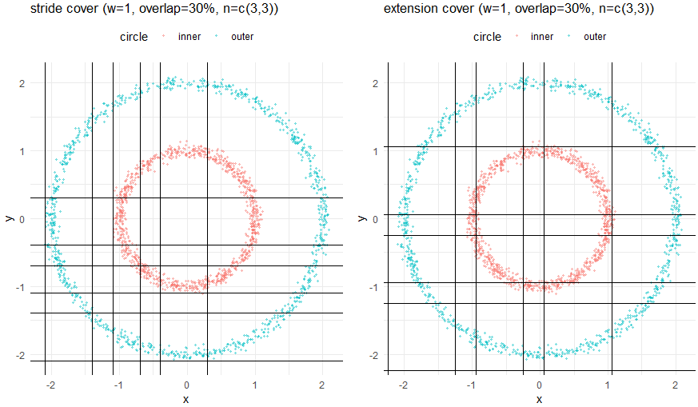
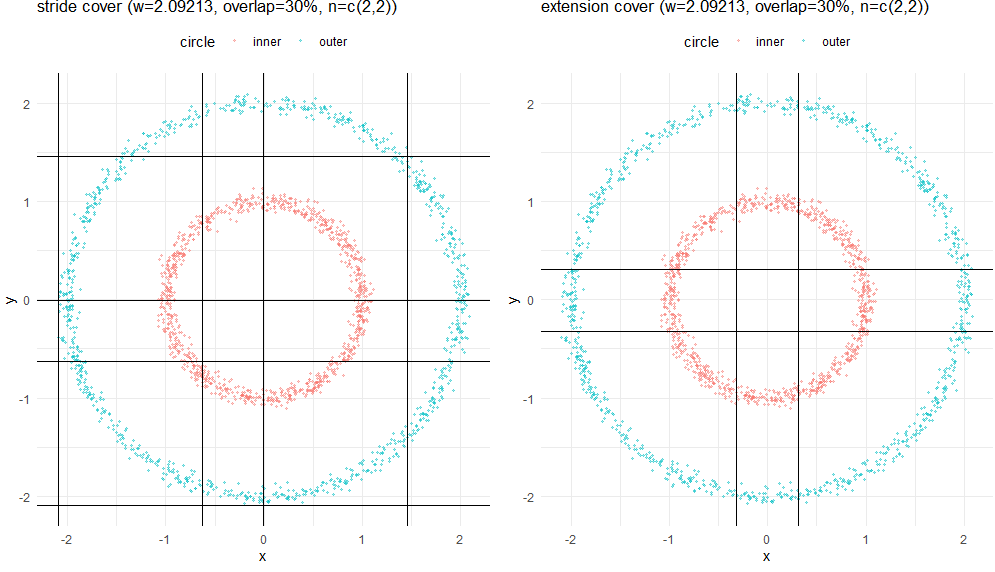
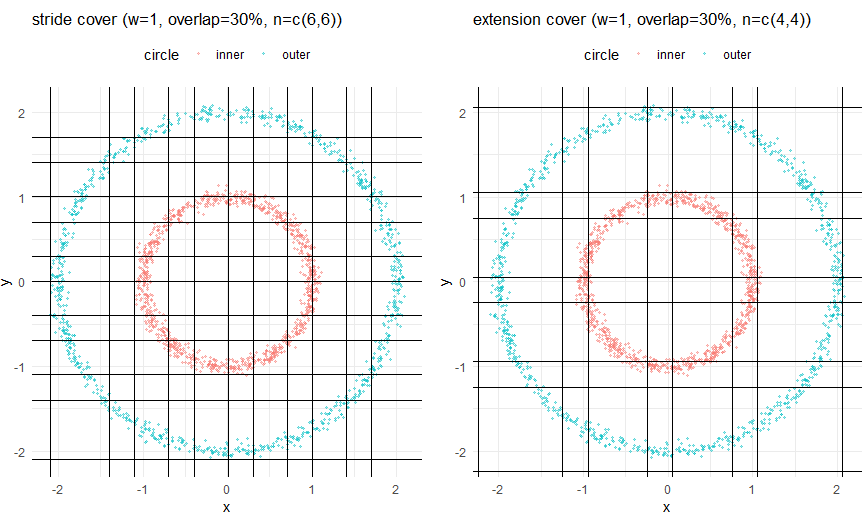

# Optimizations for cover

In the CoverTest.R, you can see that if the number of interval is fixed, you might get a bad result as shown below because intervals are not enough for the whole data points (Figure 1). Moreover, even you use (domain_max - domain_min) / num_intervals to get the best width size, stride cover won’t give you best data calculated from center of data points (Figure 2).

```{r}

```

```{r}

```

To solve the problem, you can choose only **interval_width** instead of **intervals**, and the equation is define as :

-   $stride: w\Big(1-\frac{p}{100}\Big),  \text{cover_span}=(n-1)\cdot \text{stride} + w$
-   $extension:\text {centre}\pm\tfrac{w}{2}\tfrac{p}{100}, \text{cover_span}=n\cdot w + w\frac{p}{100} = w\Big(n+\frac{p}{100}\Big)$

To get the best *n*, you then get the equation below :

$Stride:{\;n \;\ge\; \Big\lceil \frac{L - w}{\,w(1-\frac{p}{100})\,}\Big\rceil + 1\;}$

$Extention :{\;n \;\ge\; \Big\lceil \frac{L}{w} - \frac{p}{100}\Big\rceil\;}$

Finally, a uniformed intervals for your data points are constructed.

```{r}

```
