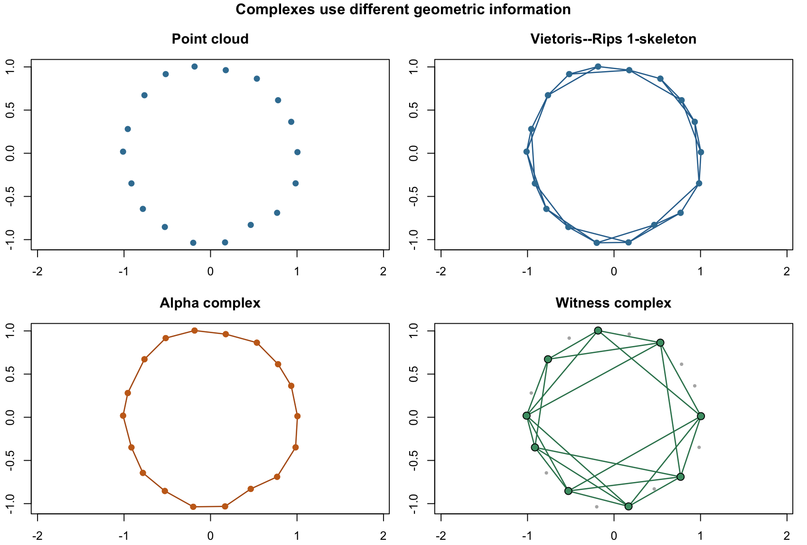
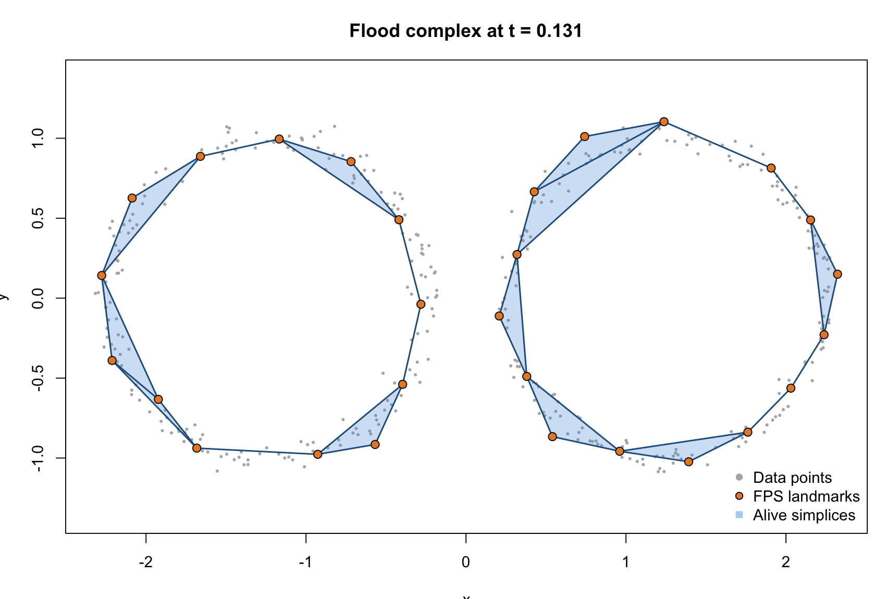
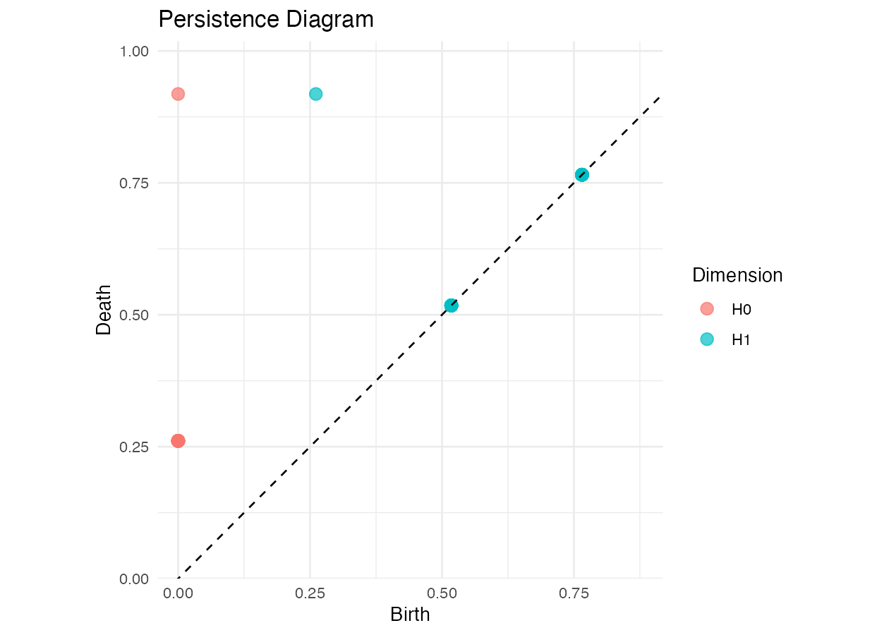
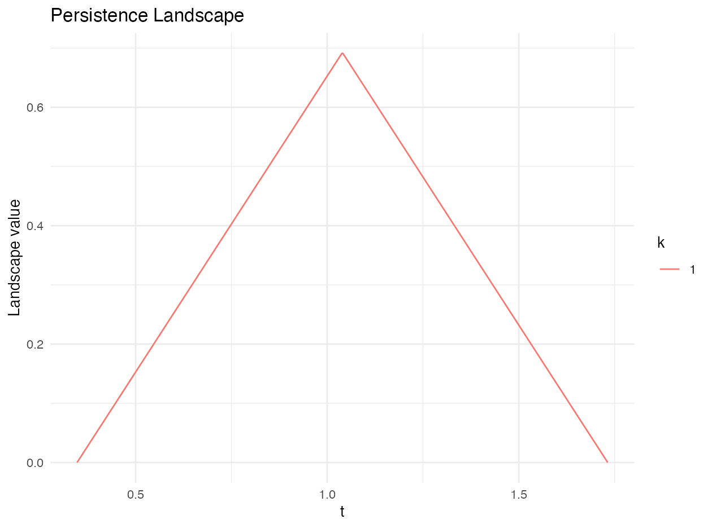
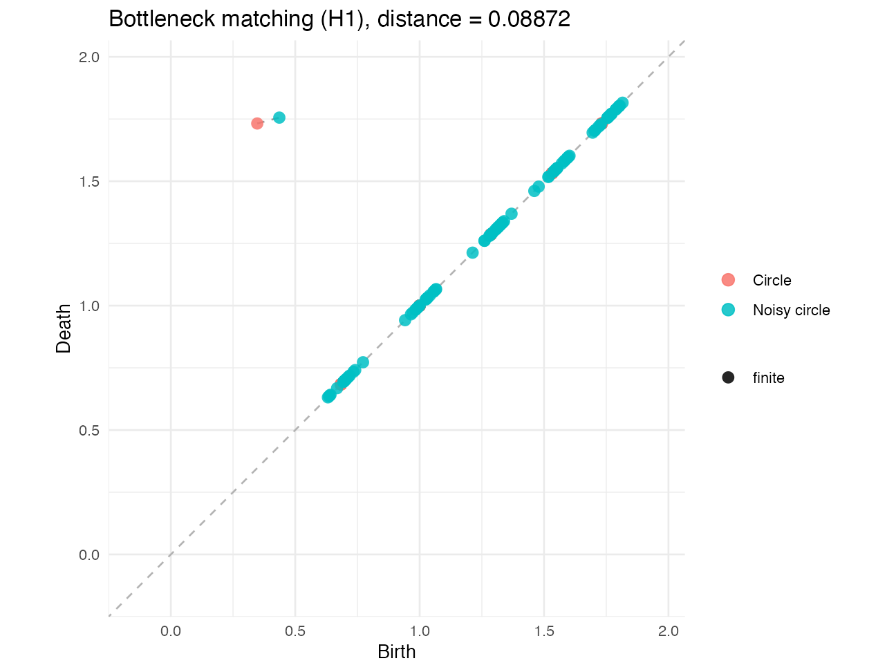

# SimplicialComplex

The SimplicialComplex package represents shapes by vertices, edges, triangles, and their higher-dimensional analogues. It supplies three connected layers: construction of complexes and filtrations, algebraic and persistent-homology calculations, and comparison of persistence summaries. The same functions support both scripted analyses and the package's Shiny explorer.

## Installation and data representation

Use the installed package for analysis. During development, `pkgload::load_all("../../SimplicialComplex")` loads the local checkout when this document is run from `Document/vignettes`.

```{r sc-setup, eval=FALSE}
library(SimplicialComplex)

theta <- seq(0, 2 * pi, length.out = 25)[-25]
circle <- cbind(cos(theta), sin(theta))
```

A complex is stored as a list of integer vertex-index vectors. For example, `list(1L, 2L, c(1L, 2L))` contains two vertices and their edge. A filtration is a sorted list whose entries have the form `list(simplex, t)`; `t` is the entry time. This common filtration format is accepted by the persistence functions regardless of how the complex was constructed.

## Faces, boundary matrices, Betti numbers, and Euler characteristic

`faces()` enumerates unique faces at a requested dimension. `boundary()` constructs the sparse boundary operator ($\partial_k$). `betti_number()` obtains ($\beta_k$) from numerical boundary-matrix ranks over the real numbers, and `euler_characteristic()` computes the alternating sum of face counts.

```{r sc-algebra, eval=FALSE}
circle_complex <- list(
  1L, 2L, 3L,
  c(1L, 2L), c(2L, 3L), c(1L, 3L)
)

faces(circle_complex, target_dim = 1)
boundary(circle_complex, 1)
betti_number(circle_complex, 0)
betti_number(circle_complex, 1)
euler_characteristic(circle_complex, tol=0.1)
```

The tolerance argument used by the rank calculations is numerical rather than a filtration threshold. For persistent homology, the package instead reduces boundary columns over ($\mathbb{F}_2$).

## Point-cloud complex constructions

`build_filtration()` provides one interface for Vietoris--Rips, Čech, Alpha, Delaunay, and Witness constructions. Flood and cubical filtrations have dedicated builders because their inputs and controls differ.

| Construction | Main function | Principal controls | Interpretation |
|---------------|---------------|---------------|----------------------------|
| Vietoris--Rips | `VietorisRipsComplex()` or `build_filtration(method = "VR")` | `epsilon` or `eps_max` | Adds an edge when two points are within the scale and fills every clique. |
| Čech | `CechComplex()` or `build_filtration(method = "Cech")` | `epsilon` or `eps_max` | Uses common intersections of equal-radius balls; exact minimum-enclosing-ball radii determine filtration times. |
| Alpha | `AlphaComplex()` or `build_filtration(method = "Alpha")` | `epsilon` or optional `eps_max` | Restricts Delaunay faces by their alpha values. |
| Delaunay | `DelaunayComplex()` or `build_filtration(method = "Delaunay")` | point coordinates | Returns the uncapped Delaunay complex and its faces. |
| Witness | `WitnessComplex()` or `build_filtration(method = "Witness")` | `landmarks`, `epsilon`/`eps_max`, `nu` | Uses a smaller landmark set and lets all observations witness landmark relations. |
| Flood | `flood_complex()` or `build_flood_filtration()` | `landmarks`, `points_per_edge`, `batch_points`, `backend` | Uses Delaunay candidate simplices on landmarks and the full point cloud to assign flood times. |
| Cubical | `build_cubical_filtration()` | `image`, `superlevel` | Triangulates a two-dimensional grid and assigns lower-star values from the image. |

```{r sc-builders, eval=FALSE}
vr <- build_filtration(circle, method = "VR", eps_max = 0.80, max_dimension = 1)
cech <- build_filtration(circle, method = "Cech", eps_max = 0.45, max_dimension = 1)
alpha <- build_filtration(circle, method = "Alpha", max_dimension = 1)
delaunay <- build_filtration(circle, method = "Delaunay", max_dimension = 1)

witness <- build_filtration(
  circle,
  method = "Witness",
  eps_max = 0.80,
  landmarks = 10,
  nu = 1,
  max_dimension = 1
)
```

When `max_dimension = k` is supplied, the builder retains simplices through dimension (k+1) internally. Those extra simplices are necessary to determine which (k)-dimensional classes die; only the requested dimensions are reported later.

```{r sc-constructions-static, echo=FALSE, out.width="92%", fig.align="center"}

```

### Vietoris--Rips and Čech

Vietoris--Rips is combinatorial: pairwise distances create a graph, and maximal cliques create higher-dimensional simplices. A simplex enters at its largest pairwise distance. Čech first uses the ($2\epsilon$) distance graph to generate candidates, then evaluates the minimum enclosing ball of each candidate. The latter more directly represents ball intersections but is usually more expensive.

### Alpha and Delaunay

Delaunay triangulation geometrically limits the candidate faces. The Alpha complex retains only faces whose alpha values do not exceed the selected scale; the corresponding uncapped construction is Delaunay. These methods require the optional `geometry` dependency and coordinates in a configuration accepted by its triangulation routines.

### Witness

The Witness complex reduces construction cost by choosing landmarks. `landmarks` may be either a count, which triggers farthest-point sampling through `generate_landmarks()`, or explicit row indices. `nu` controls the witness-distance relation, and `epsilon`/`eps_max` caps the admitted edges. Higher-dimensional simplices are filled from the resulting landmark graph.

### Flood

`flood_complex()` chooses farthest-point-sampled landmarks when a count is supplied, constructs Delaunay candidate simplices on those landmarks, and probes each simplex with a barycentric grid. Nearest-neighbour distances from the grid to the complete point cloud define filtration values. `batch_points` bounds the number of grid coordinates processed together; `backend = "cpu"` uses `RANN` when available and otherwise a chunked base-R search, while `backend = "torch"` uses chunked tensor distance matrices.

```{r sc-flood, eval=FALSE}
set.seed(20260717)
theta <- runif(600, 0, 2 * pi)
noisy_circle <- cbind(cos(theta), sin(theta)) +
  matrix(rnorm(1200, sd = 0.04), ncol = 2)

flood_filtration <- build_flood_filtration(
  noisy_circle,
  landmarks = 30,
  max_dimension = 2,
  points_per_edge = 10,
  backend = "cpu",
  batch_points = 65536
)

flood_pairs <- flood_persistence(flood_filtration, max_dimension = 1)
```

```{r sc-flood-static, echo=FALSE, out.width="84%", fig.align="center"}

```

### Cubical image filtrations

`build_cubical_filtration()` accepts a numeric matrix. Every grid cell is divided into two triangles and a simplex enters at the maximum value of its vertices, producing a lower-star filtration. With `superlevel = TRUE`, values are negated so that large original values enter first.

```{r sc-cubical, eval=FALSE}
image_values <- outer(seq(-1, 1, length.out = 30), seq(-1, 1, length.out = 30), function(x, y) sqrt(x^2 + y^2))

cubical <- build_cubical_filtration(image_values)
cubical_pairs <- persistence_pairs(cubical, max_dimension = 1)
```

## Persistent homology and persistence diagrams

`persistence_pairs()` performs sparse column reduction over ($\mathbb{F}_2$), representing a reduced column by sorted row indices instead of allocating a dense ($m\times m$) matrix. It returns `dim`, `birth`, and `death`; an infinite death denotes an essential class. `flood_persistence()` exposes the same sparse workflow for Flood filtrations.

```{r sc-persistence, eval=FALSE}
pairs <- persistence_pairs(vr, max_dimension = 1)
pd <- plot_persistence(pairs)

ggplot2::ggsave("./man/figures/PersistenceDiagram.png", pd, width = 7, height = 5, dpi = 180)
```

```{r sc-persistence-static, echo=FALSE, out.width="72%", fig.align="center"}

```

For smaller diagnostic calculations, `boundary_info()` builds and reduces the dense boundary matrix, and `extract_persistence_pairs()` converts its pivots into the same diagram format:

```{r sc-persistence-dense, eval=FALSE}
reduction <- boundary_info(vr, max_dimension = 1)
pairs_dense <- extract_persistence_pairs(vr, reduction$last_1, reduction$pivot_owner, max_dimension = 1)
```

## Persistence landscapes

`persistence_landscape()` converts finite birth--death pairs in one homological dimension into discretised landscape levels ($\lambda_k(t)$). Essential classes are reported and omitted because their death time is infinite. `plot_landscape()` returns the corresponding `ggplot2` object.

```{r sc-landscape, eval=FALSE}
landscape <- persistence_landscape(cubical_pairs, dimension = 0, k_max = 5, resolution = 500)

landscape_plot <- plot_landscape(landscape)
ggplot2::ggsave("./man/figures/PersistenceLandscape.png", landscape_plot, width = 7, height = 5, dpi = 180)
```

```{r sc-landscape-static, echo=FALSE, out.width="72%", fig.align="center"}

```

## Diagram distances and optimal matching

`wasserstein_distance()` computes the exact assignment cost with the Hungarian algorithm; its defaults are order (p=2) and the Euclidean ground metric. `bottleneck_distance()` searches the exact smallest threshold that admits a perfect matching and defaults to the ($L_\infty$) ground metric. Both match ordinary points either to the other diagram or to the diagonal.

```{r sc-distances, eval=FALSE}
set.seed(7)
circle_b <- circle + matrix(rnorm(length(circle), sd = 0.03), ncol = 2)
pairs_b <- persistence_pairs(
  build_filtration(circle_b, method = "VR", eps_max = 0.80, max_dimension = 1),
  max_dimension = 1
)

wasserstein_distance(pairs, pairs_b, dimension = 1, p = 2, ground = "L2")
bottleneck_distance(pairs, pairs_b, dimension = 1, ground = "Linf")

matching <- diagram_matching(pairs, pairs_b, dimension = 1, distance = "bottleneck", ground = "Linf")
matching_plot <- plot_matching(pairs, pairs_b, dimension = 1, distance = "bottleneck", ground = "Linf")
```

```{r sc-matching-static, echo=FALSE, out.width="74%", fig.align="center"}

```

When essential classes are present, the current implementation replaces infinite coordinates by twice the largest finite coordinate found across the two selected diagrams. Distances involving essential classes should therefore be interpreted with that explicit finite cap in mind.

## Comparing constructions and point clouds

`compare_complexes()` runs several construction methods on one point cloud and returns a timing/size summary together with the filtrations and diagrams. This separates the choice of complex from the choice of persistence summary. `complex_distance()` instead fixes one construction, builds diagrams for two point clouds, and returns their Wasserstein or bottleneck distance.

```{r sc-comparison, eval=FALSE}
comparison <- compare_complexes(
  circle,
  methods = c("VR", "Alpha", "Delaunay", "Witness"),
  eps_max = 0.80,
  landmarks = 10
)
comparison$summary

cloud_distance <- complex_distance(
  circle,
  circle_b,
  method = "VR",
  distance = "bottleneck",
  dimension = 1,
  eps_max = 0.80
)
cloud_distance$distance
```